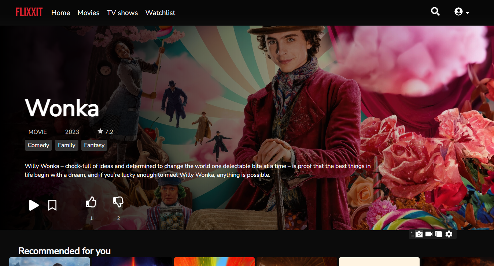

# Flixxit - Your Personal Entertainment Hub

Welcome to Flixxit, your personal streaming experience built with the MERN stack. Flixxit aims to bring the best of OTT platforms to your fingertips.


## Table of  Contents
- [Features](#features)
- [Tech Stack](#tech-stack)
- [Setup Instructions](#setup-instructions)
  - [Prerequisites](#prerequisites)
  - [Steps to Run Locally](#steps-to-run-locally)
- [Usage](#usage)
- [API References](#api-references)

## Features
### 1. User Accounts
- Sign up and log in using email IDs and passwords for simplicity.

### 2. User Profile
- Access a personalized user profile displaying account information.
- View consumed content history.
- Update user profile

### 3. Dashboard
- Browse a variety of titles using horizontally scrollable carousels categorized by popular, trending and more.

### 4. Title View
- Click on a title to explore its synopsis, rating, and other details.

### 5. Search
- Utilize the search feature to discover various types of content, including web series, movies, short films, and documentaries.

### 6. Watchlist
- Add programs to watchlist and watch it anytime.

### 7. Rating
- Allow users to upvote or downvote programs and display the count.

### 8. Video Player
- Preview or play selected content with a "Skip Intro" feature.

### 9. Payment and Subscription
- Subscribe to monthly or yearly plans for full access.

### 10. About Us
- Learn more about Flixxit, including features, origin, copyrights, terms, and conditions.
## Tech Stack


## Setup instructions

### Prerequisites
- Node.js and npm installed.
- MongoDB server running.

### Steps to Run Locally
1. Clone the repository: 

`git clone https://github.com/Neharavi262001/Flixxit-capstone.git`

2. Navigate to the project folder. Open a terminal in root directory. To install dependencies for backend:

```bash
 npm install
```
3. Rename `.env.example` to `.env` file in root directory.
 Set up environment variables .To run this project, you will need to add the following environment variables to your .env file.
For Stripe, go to [Stripe](https://stripe.com/) and get your publishable key and secret key.

`PORT`
`SECRET_TOKEN`
`STRIPE_PUBLISHABLE_KEY`
`STRIPE_SECRET_KEY`

4. Navigate to the app directory  and install dependencies for frontend
```bash
  cd app
  npm install
```
5. Rename `.env.example` to `.env` file in app directory.
Set up environment variables.To run this project, you will need to add the following environment variables to your .env file. 
Go to [The Movie Database (TMDb)](https://www.themoviedb.org/) and get your TMDB token and paste it.

`VITE_APP_TMDB_TOKEN`

To run the project, navigate to root directory

```bash
 cd ..
```
Run the app and server concurrently
```bash
 npm run dev
```
(or)
Run server and app separately 
```bash
 npm run app
npm run server
```
### Usage

To use Flixxit, follow these steps:

1. **Register:**
   - Create a new account by signing up with your name, email ID and password.
    - Remember to register using a strong password, including uppercase letters and numbers.
    - 


2. **Select a Plan:**
   - Choose a subscription plan (monthly or yearly) that suits your preferences.
    - 


3. **Checkout with Stripe:**
   - Proceed to checkout using Stripe for secure and efficient payment processing.
   - Use the following test card number for payments in India: **4000003560000008**.
    - 


4. **Log In:**
   - Log in to your Flixxit account with your credentials.
    - 
   


5. **Enjoy Watching:**
   - Explore the diverse range of content available on Flixxit.
   - Add programs to your watchlist for easy access.
   - Rate and review your favorite titles.
   - Utilize the search feature to discover new content.
   - Use the video player with the "Skip Intro" feature for a seamless viewing experience.

6. **Screenshots:**
<<<<<<< HEAD
   - 
   - 
   - 
   - 
   - 


Now you're all set to enjoy a personalized streaming experience on Flixxit!
=======
   - 
   - 
   - 

Now you're all set to enjoy a personalized streaming experience on Flixxit!


## Demo

Insert gif or link to demo


## API Reference


Flixxit utilizes the following APIs for enriched content data and functionality:

- [The Movie Database (TMDb)](https://www.themoviedb.org/) - A comprehensive movie and TV show database used for content information.
- [Stripe](https://stripe.com/) - A secure and efficient payment processing API used for handling subscription payments.
